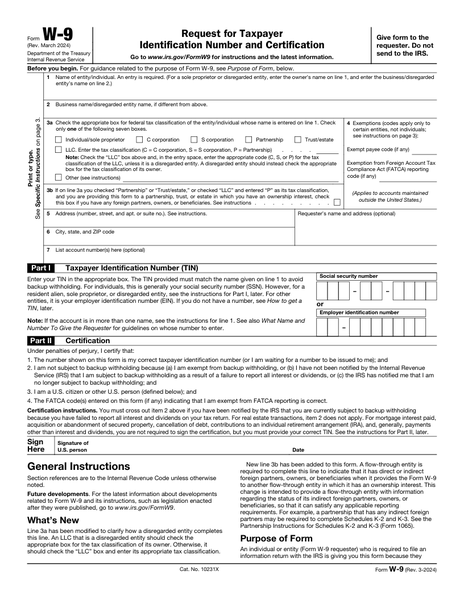
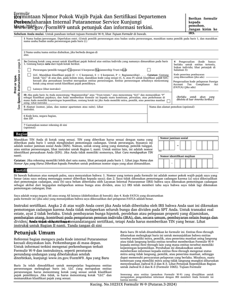
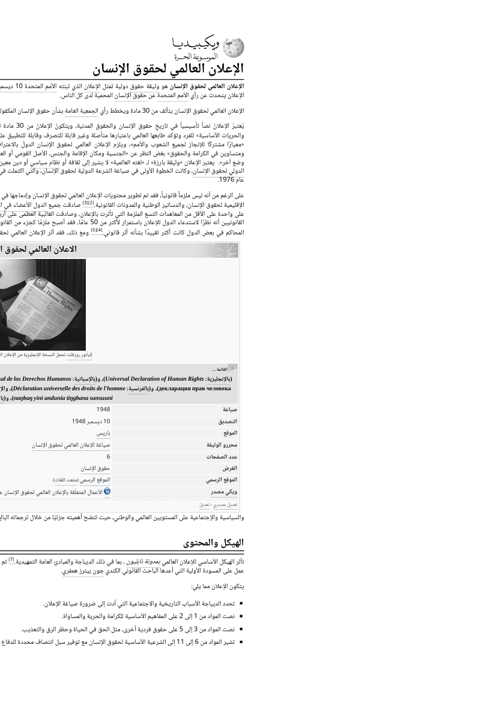
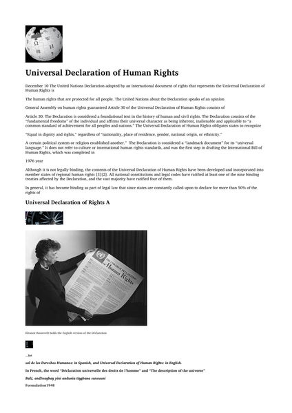
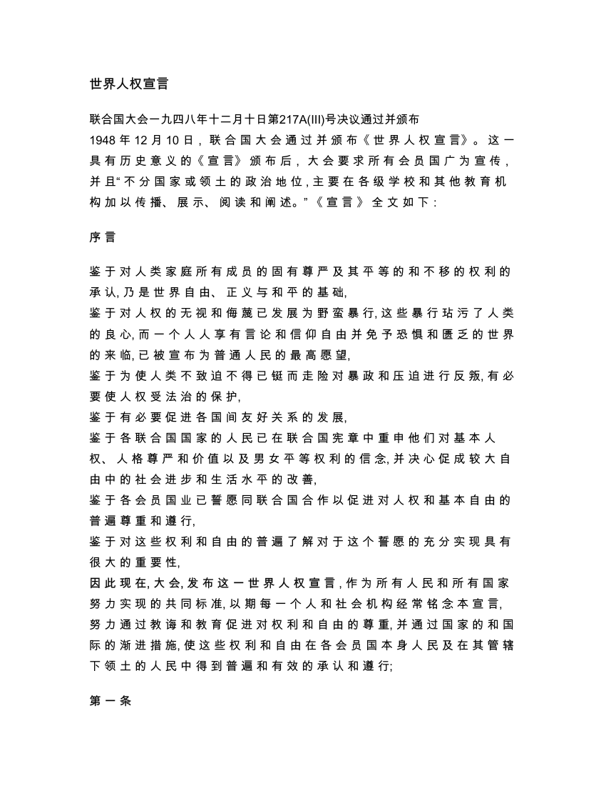
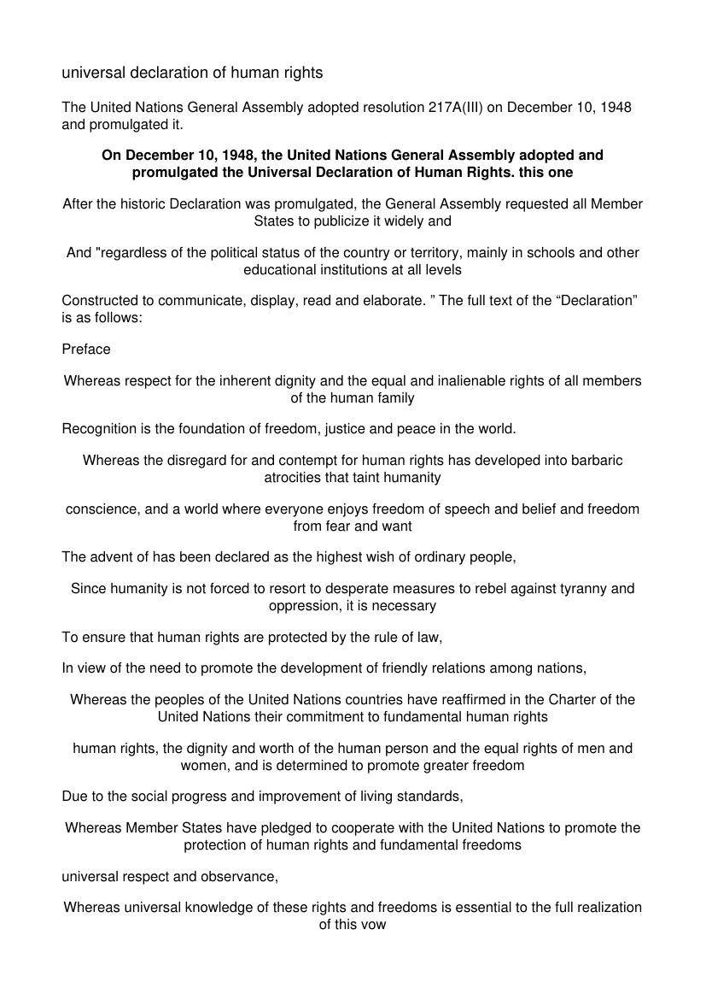
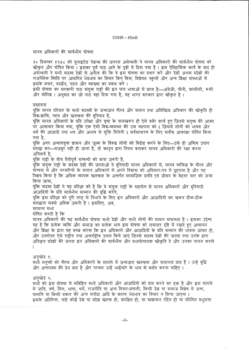
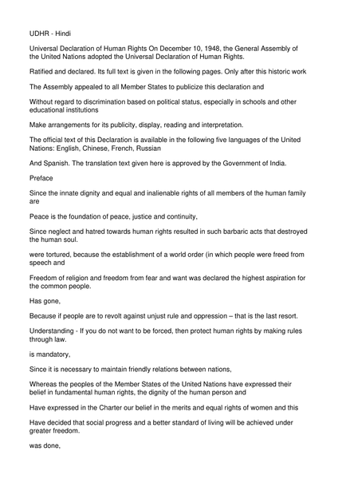
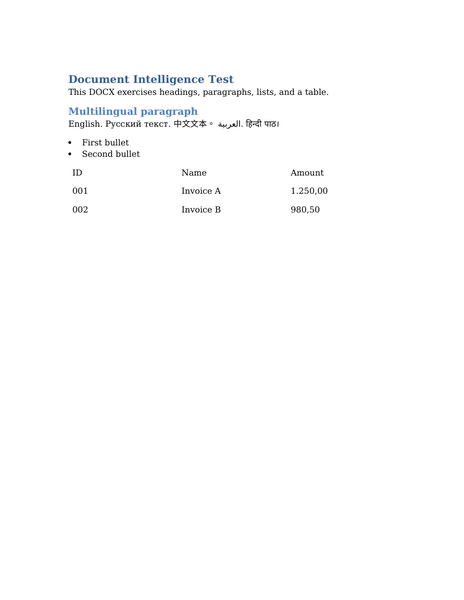

# Examples gallery

Real **input → output** pairs produced by transdoc, so you can see what it does before running it.
Every example uses `--to same-as-source` (the format is preserved); source and output files are in
[`examples/`](examples) and the thumbnails show page 1. The set covers both fidelity modes — a
**layout-exact** form (output ≡ input, only the language changes) and **cross-script reflows**
(RTL/CJK/scan → English, where the text is reflowed for readability).

> Reproduce any row:
> ```bash
> cd backend
> transdoc translate <source> --lang en --to same-as-source
> ```
> Quality numbers are reference-free COMET-Kiwi QE (mean over scored segments). Sources are
> public domain (UN Universal Declaration of Human Rights; a US IRS W-9 form) plus one synthetic
> DOCX.

| Example | Source | Output |
|---------|--------|--------|
| **IRS W-9 form (AcroForm PDF)** → Indonesian · **layout overlay**<br>every line/box/checkbox/field kept; only the text changes. The dense IRS instruction prose shrinks slightly to fit the longer Indonesian (overlay trade-off, flagged in the report — use `--to docx` for a reflow).<br>[source](examples/form-w9.src.pdf) · [output](examples/form-w9.id.pdf) |  |  |
| **Arabic — RTL digital PDF** → English · QE ≈ 0.74<br>[source](examples/arabic.src.pdf) · [output](examples/arabic.en.pdf) |  |  |
| **Chinese — CJK digital PDF** → English · QE ≈ 0.78<br>[source](examples/chinese.src.pdf) · [output](examples/chinese.en.pdf) |  |  |
| **Hindi — scanned PDF (OCR)** → English · QE ≈ 0.75<br>[source](examples/hindi-scan.src.pdf) · [output](examples/hindi-scan.en.pdf) |  |  |
| **Multilingual DOCX** → English (round-trip)<br>[source](examples/mixed-docx.src.docx) · [output](examples/mixed-docx.en.docx) |  |  |

## What these show

- **Forms keep their layout.** The IRS W-9 is detected as an AcroForm and rendered with the overlay
  path: every line, box, and checkbox stays in place and only the text is swapped — the north-star
  "output is the input, only the language changes". Where the translation is longer than the
  original (e.g. dense IRS instruction headings), the overlay shrinks it to fit and the report flags
  any text that fell below a readable size; `--to docx` reflows those for full readability.
- **Cross-script documents reflow cleanly.** RTL Arabic and CJK Chinese reflow into English;
  the Wikipedia logo, the Eleanor-Roosevelt figure, and its caption stay in place (caption
  anchoring). Cross-script sources reflow (FLOW) instead of being force-fit into the source's
  per-glyph geometry.
- **Scanned documents work.** The Hindi example is an image-only PDF — OCR → translate → clean
  English output, no source text layer required.
- **In-place Office round-trip.** The DOCX keeps its headings, list, and table; only the language
  changes (the multilingual line is normalised to English).

## Notes & limits

- Quality is engine- and source-bound. Distant pairs (CJK/RTL → English) and noisy scans score
  lower than same-script pairs; very poor scans (faint historical manuscripts) remain OCR-limited.
- These are reference samples, not a benchmark. Run the [eval harness](DEVELOPMENT.md#evaluation-harness)
  for measured quality.

See also: [USAGE.md](USAGE.md) · [QUALITY.md](QUALITY.md) · [FIDELITY.md](FIDELITY.md)
